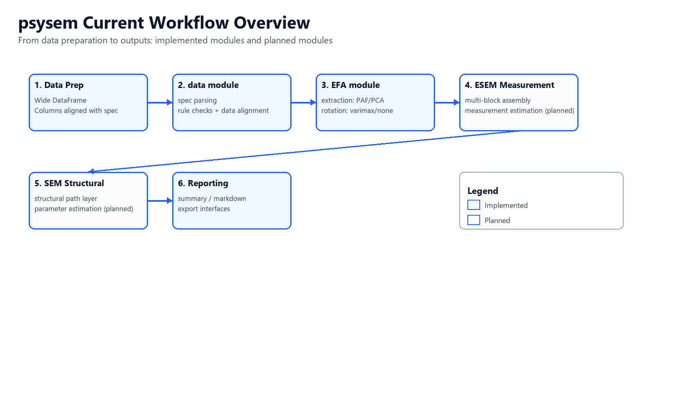
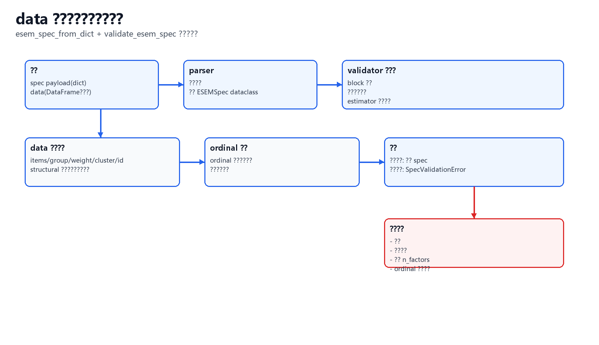
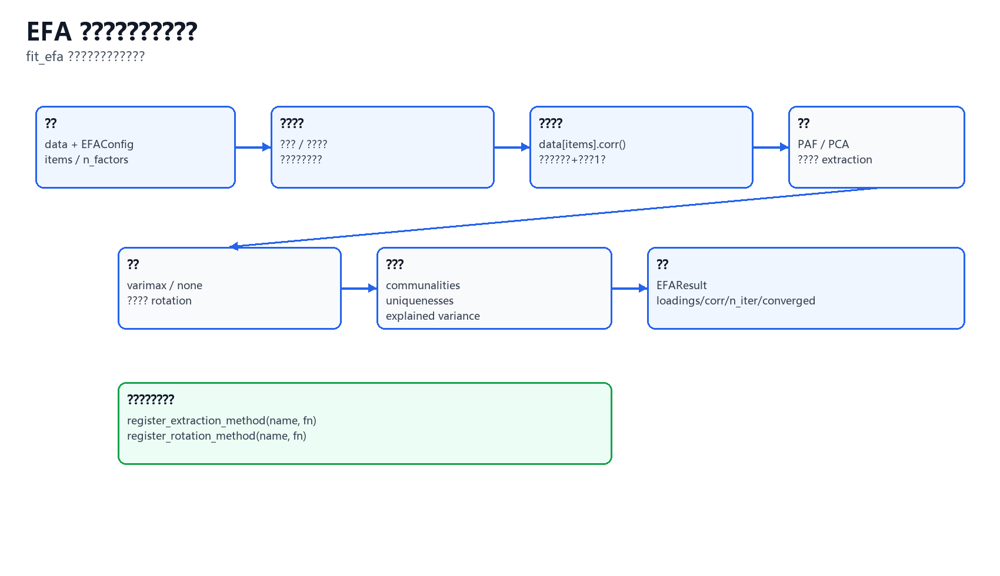

# psysem

`psysem` 是一个面向心理测量场景的 Python SEM/ESEM 包（当前为早期 alpha 阶段）。

目标是把 ESEM 拆成清晰模块并逐步落地：

1. `data`：输入契约与数据校验
2. `efa`：可扩展的探索性因子提取/旋转
3. `esem_measurement`（规划中）：多 block 测量模型组装
4. `sem_structural`（规划中）：结构路径层与完整估计

---

## 当前状态（2026-03）

| 模块 | 状态 | 说明 |
| --- | --- | --- |
| `psysem.data` | 可用 | `spec` 解析 + 规则校验 + 与 `DataFrame` 对齐校验 |
| `psysem.efa` | 可用（Phase 3 进行中） | `PAF/PCA`、KMO/Bartlett、PA/MAP/Scree/Kaiser、候选拟合评分与最优因子数选择 + 模块化解释输出 |
| `SEMModel` | Phase 1 完成基础版 + Phase 2/3 起步 | 结构化解析 + 参数表草稿 + measurement/structural 矩阵草图 + 全局参数索引映射；估计器仍为占位 |
| `psysem.esem_spec` | 兼容层 | 旧导入路径，内部已转发到 `psysem.data` |

---

## 流程图（当前实现）

### 1) 总流程（模块视角）



### 2) `data` 模块流程（spec 解析与校验）



### 3) `efa` 模块流程（fit_efa）



---

## 安装

```bash
pip install -e .[dev]
```

开发环境常用命令：

```bash
python -m ruff check .
python -m mypy src
python -m pytest -q
```

---

## EFA 测试与质量门禁（2026-03-11）

当前仓库测试数量：`121`（其中 EFA 相关测试 `67`）。

EFA 已覆盖以下测试层级：

1. `fit`：输入校验、提取/旋转注册、残差结构、告警触发
2. `diagnostics`：`KMO/Bartlett`、缺失值策略、常量项/奇异矩阵容错
3. `n_factors`：`PA/MAP/Scree/Kaiser`、共识策略、可复现性、参数边界
4. `evaluation`：候选评分、阈值校验、结果行导出
5. `interpretation`：`item_table/factor_table/residual_top_pairs` 与阈值校验
6. `workflow`：端到端流程、候选策略、解释开关、配置一致性

仅运行 EFA 测试：

```bash
python -m pytest tests/test_efa.py tests/test_efa_* -q
```

详细说明见：

- [docs/efa-testing.zh-CN.md](docs/efa-testing.zh-CN.md)

---

## 快速开始

### 1) SEM 占位拟合（当前 smoke API）

```python
import pandas as pd
from psysem import SEMModel

data = pd.DataFrame(
    {
        "x1": [1.0, 2.0, 3.0],
        "x2": [1.1, 2.1, 3.1],
        "y": [0.9, 2.0, 3.2],
    }
)

model = SEMModel("y ~ x1 + x2")
result = model.fit(data)
print(result.summary())
```

### 2) ESEM `spec` 解析与校验（`data` 模块）

```python
import pandas as pd
from psysem.data import esem_spec_from_dict, validate_esem_spec

payload = {
    "blocks": [
        {
            "name": "internalizing",
            "items": ["i1", "i2", "i3", "i4"],
            "n_factors": 2,
        }
    ],
    "estimator": "WLSMV",
    "rotation": {"method": "geomin", "oblique": True},
    "variable_types": {
        "i1": "ordinal",
        "i2": "ordinal",
        "i3": "ordinal",
        "i4": "ordinal",
        "wellbeing": "continuous",
    },
    "structural": ["wellbeing ~ internalizing_f1 + internalizing_f2"],
}

data = pd.DataFrame(
    {
        "i1": [1, 2, 3],
        "i2": [2, 2, 3],
        "i3": [1, 3, 4],
        "i4": [2, 2, 3],
        "wellbeing": [45.0, 50.0, 62.0],
    }
)

spec = esem_spec_from_dict(payload)
validate_esem_spec(spec, data)
```

### 3) EFA 拟合（`efa` 模块）

```python
import pandas as pd
from psysem import EFAConfig, fit_efa

data = pd.DataFrame(
    {
        "i1": [1.2, 1.5, 0.8, 1.7],
        "i2": [1.1, 1.3, 0.9, 1.8],
        "i3": [1.0, 1.4, 0.7, 1.6],
        "i4": [0.5, 0.9, 1.8, 1.7],
        "i5": [0.6, 1.0, 1.7, 1.8],
        "i6": [0.4, 0.8, 1.9, 1.6],
    }
)

config = EFAConfig(
    items=("i1", "i2", "i3", "i4", "i5", "i6"),
    n_factors=2,
    extraction="paf",    # paf | pca
    rotation="varimax",  # varimax | none
)

result = fit_efa(data, config)
print(result.loadings)
print(result.explained_variance)
```

### 4) EFA 诊断与自动建议因子数（Phase 1）

```python
import pandas as pd
from psysem import (
    EFADiagnosticsConfig,
    FactorSelectionConfig,
    run_efa_diagnostics,
    suggest_n_factors,
)

data = pd.read_csv("examples/data/efa_demo_input.csv")
items = tuple(data.columns)

diag = run_efa_diagnostics(data, EFADiagnosticsConfig(items=items))
selection = suggest_n_factors(
    data,
    FactorSelectionConfig(
        items=items,
        n_min=1,
        n_max=4,
        pa_iter=200,
        random_state=42,
    ),
)

print(diag.kmo_total, diag.kmo_label)
print(diag.bartlett_chi2, diag.bartlett_df, diag.bartlett_p)
print(selection.suggestions_by_method)
print(selection.consensus_n_factors)
```

### 5) EFA 自动化工作流（Phase 2 + Phase 3 解释输出）

```python
import pandas as pd
from psysem import (
    EFADiagnosticsConfig,
    EFAEvaluationConfig,
    EFAInterpretationConfig,
    EFAWorkflowConfig,
    FactorSelectionConfig,
    run_efa_workflow,
)

data = pd.read_csv("examples/data/efa_demo_input.csv")
items = tuple(data.columns)

workflow = run_efa_workflow(
    data,
    EFAWorkflowConfig(
        items=items,
        diagnostics=EFADiagnosticsConfig(items=()),
        selection=FactorSelectionConfig(items=(), n_min=1, n_max=4, pa_iter=200, random_state=42),
        evaluation=EFAEvaluationConfig(),
        interpretation=EFAInterpretationConfig(
            salient_loading=0.30,
            cross_loading=0.30,
            min_h2=0.20,
            residual_top_n=10,
        ),
        candidate_strategy="selection_union",
        include_consensus=True,
        include_interpretation=True,
        extraction="paf",
        rotation="varimax",
    ),
)

print(workflow.best_n_factors)
print(workflow.comparison_table[["n_factors", "score"]])
if workflow.best_interpretation is not None:
    print(workflow.best_interpretation.summary)
    print(workflow.best_interpretation.residual_top_pairs.head())
```

### 6) 单模型解释输出（Phase 3）

```python
import pandas as pd
from psysem import EFAConfig, EFAInterpretationConfig, fit_efa, interpret_efa

data = pd.read_csv("examples/data/efa_demo_input.csv")
items = tuple(data.columns)

fitted = fit_efa(
    data,
    EFAConfig(items=items, n_factors=2, extraction="paf", rotation="varimax"),
)
interpreted = interpret_efa(
    fitted,
    EFAInterpretationConfig(
        salient_loading=0.30,
        cross_loading=0.30,
        min_h2=0.20,
        min_salient_items_per_factor=2,
        residual_top_n=10,
    ),
)

print(interpreted.item_table.head())
print(interpreted.factor_table)
print(interpreted.residual_top_pairs.head())
print(interpreted.warnings)
```

`fit_efa` 当前结果字段：

| 字段 | 说明 |
| --- | --- |
| `loadings` | 旋转载荷矩阵 |
| `communalities` | 共同度（`h2`） |
| `uniquenesses` | 唯一性（`u2`） |
| `complexity` | 题项复杂度（R 风格 `com` 近似） |
| `explained_variance` | 各因子解释方差 |
| `correlation_matrix` | 输入相关矩阵 |
| `residual_matrix` | 相关矩阵残差（观测 - 重构） |
| `residual_summary` | 残差摘要（`rmsr` 等） |
| `factor_correlation` | 因子相关矩阵（当前正交旋转为单位阵） |
| `cross_loaded_items` | 交叉载荷题项列表（阈值 `0.30`） |
| `warnings` | 解读告警（低共同度/高残差/交叉载荷等） |

`interpret_efa` 当前结果字段：

| 字段 | 说明 |
| --- | --- |
| `item_table` | 题项级解读表（主载荷、`h2/u2/com`、交叉载荷计数、低共同度标记） |
| `factor_table` | 因子级解读表（`ss_loadings`、方差占比、累计方差、显著题项数） |
| `residual_top_pairs` | 绝对残差最大的题项对（Top-N） |
| `warnings` | 基于阈值规则生成的解释告警 |
| `summary` | 汇总指标（交叉载荷个数、低共同度个数、`rmsr`、最大残差等） |

`run_efa_workflow` 结果对象新增字段：

| 字段 | 说明 |
| --- | --- |
| `candidate_interpretations` | `n_factors -> EFAInterpretationResult` 映射 |
| `best_interpretation` | 最优候选对应的解释结果（可关闭） |

---

## ESEM 输入契约（当前实现）

### 顶层字段

| 字段 | 类型 | 必填 | 说明 |
| --- | --- | --- | --- |
| `blocks` | `list[dict]` | 是 | ESEM block 列表 |
| `estimator` | `str` | 是 | 支持：`ML`、`MLR`、`WLSMV` |
| `variable_types` | `dict[str, str]` | 是 | 变量类型映射：`continuous`、`ordinal` |
| `rotation` | `dict` | 否 | 全局旋转设置 |
| `structural` | `list[str]` | 否 | 结构路径字符串列表 |
| `group` | `str` | 否 | 分组列名 |
| `weight` | `str` | 否 | 权重列名 |
| `cluster` | `str` | 否 | 聚类列名 |
| `id` | `str` | 否 | 个体 ID 列名 |
| `allow_item_overlap` | `bool` | 否 | 是否允许题项跨 block 重复 |

### `blocks[]` 字段

| 字段 | 类型 | 必填 | 说明 |
| --- | --- | --- | --- |
| `name` | `str` | 是 | block 名称（必须唯一） |
| `items` | `list[str]` | 是 | 题项列名列表 |
| `n_factors` | `int` | 是 | 因子个数，需满足 `0 < n_factors < len(items)` |
| `rotation` | `dict` | 否 | block 级旋转设置（覆盖全局） |

### `rotation` 字段

| 字段 | 类型 | 必填 | 默认值 | 说明 |
| --- | --- | --- | --- | --- |
| `method` | `str` | 是 | - | 旋转方法名 |
| `oblique` | `bool` | 否 | `True` | 是否允许因子相关 |

---

## `data` 模块当前做了哪些校验

- `blocks` 非空，`name/items/n_factors` 合法
- `estimator` 在支持集合内
- `variable_types` 的 key/value 格式合法且类型值受限
- 未开启 `allow_item_overlap` 时，禁止题项跨 block 重复
- `structural` 中的观测变量必须在 `variable_types` 中声明
- 传入 `data` 时，校验：
  - block 题项列必须存在
  - `group/weight/cluster/id` 若声明则必须存在
  - `structural` 中观测变量列必须存在
  - 标记为 `ordinal` 的列必须是“有序整数型”数值

---

## EFA 参数与可扩展机制

`EFAConfig` 主要参数：

| 参数 | 类型 | 默认值 | 说明 |
| --- | --- | --- | --- |
| `items` | `tuple[str, ...]` | - | 用于 EFA 的题项列 |
| `n_factors` | `int` | - | 提取因子数 |
| `extraction` | `str` | `paf` | 提取方法名（注册表 key） |
| `rotation` | `str` | `varimax` | 旋转方法名（注册表 key） |
| `max_iter` | `int` | `200` | 迭代上限（如 PAF） |
| `tol` | `float` | `1e-6` | 收敛阈值 |
| `min_uniqueness` | `float` | `0.005` | 唯一性下界 |

`EFADiagnosticsConfig` 主要参数：

| 参数 | 类型 | 默认值 | 说明 |
| --- | --- | --- | --- |
| `items` | `tuple[str, ...]` | - | 用于诊断的题项列 |
| `dropna` | `bool` | `True` | 是否在诊断前删除缺失行 |
| `min_sample_ratio` | `float` | `5.0` | 最低样本比阈值（`n_obs / n_items`） |

`FactorSelectionConfig` 主要参数：

| 参数 | 类型 | 默认值 | 说明 |
| --- | --- | --- | --- |
| `items` | `tuple[str, ...]` | - | 用于因子数建议的题项列 |
| `n_min` | `int` | `1` | 搜索最小因子数 |
| `n_max` | `int \| None` | `None` | 搜索最大因子数（默认 `n_items - 1`） |
| `pa_iter` | `int` | `500` | Parallel Analysis 重采样次数 |
| `pa_percentile` | `float` | `0.95` | PA 分位阈值 |
| `random_state` | `int \| None` | `None` | 随机种子 |
| `enable_pa` | `bool` | `True` | 启用 PA |
| `enable_map` | `bool` | `True` | 启用 MAP |
| `enable_kaiser` | `bool` | `True` | 启用 Kaiser |
| `enable_scree` | `bool` | `True` | 启用 Scree 拐点建议 |
| `consensus_strategy` | `str` | `majority_min_tie` | 聚合策略：`majority_min_tie`、`weighted_vote`、`stability_first`、`median_floor` |
| `consensus_weights` | `dict[str, float] \| None` | `None` | `weighted_vote` 下的方法权重（未指定方法默认 1.0） |

`EFAEvaluationConfig` 主要参数：

| 参数 | 类型 | 默认值 | 说明 |
| --- | --- | --- | --- |
| `salient_loading` | `float` | `0.30` | 显著载荷阈值 |
| `cross_loading` | `float` | `0.30` | 交叉载荷判定阈值 |
| `min_h2` | `float` | `0.20` | 低共同度判定阈值 |
| `variance_weight` | `float` | `1.00` | 解释方差权重 |
| `simplicity_weight` | `float` | `0.75` | 简单结构权重 |
| `communality_weight` | `float` | `0.50` | 共同度权重 |
| `cross_loading_penalty` | `float` | `1.00` | 交叉载荷惩罚权重 |
| `factor_balance_penalty` | `float` | `0.25` | 因子不平衡惩罚权重 |

`EFAInterpretationConfig` 主要参数：

| 参数 | 类型 | 默认值 | 说明 |
| --- | --- | --- | --- |
| `salient_loading` | `float` | `0.30` | 显著载荷阈值 |
| `cross_loading` | `float` | `0.30` | 交叉载荷判定阈值（需 `>= salient_loading`） |
| `min_h2` | `float` | `0.20` | 低共同度判定阈值 |
| `min_salient_items_per_factor` | `int` | `2` | 因子最少显著题项数阈值 |
| `rmsr_warning` | `float` | `0.08` | RMSR 告警阈值 |
| `max_abs_residual_warning` | `float` | `0.10` | 最大绝对残差告警阈值 |
| `residual_top_n` | `int` | `10` | 输出的 Top-N 残差题项对数量 |

`EFAWorkflowConfig` 主要参数：

| 参数 | 类型 | 默认值 | 说明 |
| --- | --- | --- | --- |
| `items` | `tuple[str, ...]` | - | 分析题项列 |
| `selection` | `FactorSelectionConfig` | - | 因子数建议配置 |
| `diagnostics` | `EFADiagnosticsConfig` | - | 诊断配置 |
| `evaluation` | `EFAEvaluationConfig` | - | 评分配置 |
| `interpretation` | `EFAInterpretationConfig` | - | 解释输出配置 |
| `extraction` | `str` | `paf` | 候选模型提取方法 |
| `rotation` | `str` | `varimax` | 候选模型旋转方法 |
| `max_iter` | `int` | `200` | 候选拟合迭代上限 |
| `tol` | `float` | `1e-6` | 候选拟合收敛阈值 |
| `min_uniqueness` | `float` | `0.005` | 唯一性下界 |
| `candidate_strategy` | `str` | `selection_union` | 候选策略：`selection_union` 或 `range` |
| `include_consensus` | `bool` | `True` | 候选中是否包含共识因子数 |
| `manual_candidates` | `tuple[int, ...]` | `()` | 手动补充候选因子数 |
| `include_interpretation` | `bool` | `True` | 是否为每个候选自动构建解释结果 |

可注册自定义方法：

```python
import numpy as np
from psysem import (
    EFAConfig,
    register_extraction_method,
    register_rotation_method,
    list_extraction_methods,
    list_rotation_methods,
)

def my_extraction(corr: np.ndarray, config: EFAConfig):
    p = corr.shape[0]
    loadings = np.zeros((p, config.n_factors), dtype=float)
    communalities = np.zeros(p, dtype=float)
    return loadings, communalities, 1, True

def my_rotation(loadings: np.ndarray, _: EFAConfig):
    return loadings

register_extraction_method("my_extraction", my_extraction, overwrite=True)
register_rotation_method("my_rotation", my_rotation, overwrite=True)

print(list_extraction_methods())
print(list_rotation_methods())
```

---

## 项目结构（核心部分）

```text
src/psysem/
  data/
    contracts.py
    parser.py
    validator.py
    validators/
  efa/
    __init__.py
    contracts.py
    diagnostics.py
    evaluation.py
    fit.py
    interpretation.py
    n_factors.py
    workflow.py
  measurement/
    __init__.py
    contracts.py
    builder.py
    identification.py
  structural/
    __init__.py
    contracts.py
    builder.py
    validation.py
  core.py
  model.py
  parameter_index.py
  result.py
  reporting.py
```

---

## 兼容导入路径

旧路径仍可用：

```python
from psysem.esem_spec import esem_spec_from_dict, validate_esem_spec
```

推荐新路径：

```python
from psysem.data import esem_spec_from_dict, validate_esem_spec
```

---

## Roadmap

1. `esem_measurement`：基于 block 的测量层组装与估计接口
2. `sem_structural`：更严格结构语法与参数估计
3. 扩展 EFA/ESEM 的提取和旋转方法（插件化管理）
4. 报告层增强（fit 指标、参数表、导出）

EFA 分阶段实施文档（详细步骤）：

- [docs/efa-phase1-implementation.zh-CN.md](docs/efa-phase1-implementation.zh-CN.md)

EFA 当前阶段进展：

1. Phase 1：已完成（诊断 + 因子数建议）
2. Phase 2：已完成基础版（候选拟合 + 评分 + 最优候选选择）
3. Phase 3：进行中（模块化解释输出 `interpret_efa` + workflow 接入）
4. Phase 4（可选）：未开始（高级方法与性能优化）

SEM 分阶段实施文档（详细步骤）：

- [docs/sem-phase-implementation.zh-CN.md](docs/sem-phase-implementation.zh-CN.md)

---

## SEM 模块拆分思路（TODO）

下面是面向 `SEMModel.fit(...)` 的推荐分层，目标是把“语法、矩阵、优化、统计推断、报告”解耦，便于逐模块迭代和测试。

详细实施步骤见：

- [docs/sem-phase-implementation.zh-CN.md](docs/sem-phase-implementation.zh-CN.md)

### 1) 模块边界（建议）

| 模块 | 主要职责 | 输入 | 输出 |
| --- | --- | --- | --- |
| `psysem.syntax` | 解析模型语法（测量/结构/约束） | 语法字符串或 `spec` | 标准化 AST/ModelSpec |
| `psysem.data` | 数据契约与预校验 | `DataFrame` + spec | 校验后的分析视图与元信息 |
| `psysem.measurement` | 测量层组装（CFA/ESEM block） | AST + 数据视图 | 测量模型矩阵定义 |
| `psysem.structural` | 结构路径层组装 | AST + latent/observed 索引 | 结构模型矩阵定义 |
| `psysem.estimation` | 目标函数、优化器、收敛控制 | 模型矩阵 + 数据矩阵 + estimator | 参数估计值 + 收敛状态 |
| `psysem.inference` | 标准误、检验、置信区间 | 参数估计 + 信息矩阵 | SE/z/p/CI |
| `psysem.fit` | 拟合指标计算 | 样本统计量 + 模型 implied 统计量 | CFI/TLI/RMSEA/SRMR/AIC/BIC |
| `psysem.reporting` | 结果对象和导出格式 | 参数表 + 拟合指标 + 警告 | `SEMResult`/Markdown/表格 |

### 2) 推荐目录（目标形态）

```text
src/psysem/
  syntax/
  data/
  measurement/
  structural/
  estimation/
  inference/
  fit/
  reporting/
  core.py
  result.py
```

### 3) TODO（按阶段）

#### Phase 1: 入口与契约统一

- [x] 让 `SEMModel.fit(data, spec=...)` 支持显式 `ESEMSpec` 输入
- [x] 统一 `syntax` 与 `spec` 两条入口到同一内部 `ModelSpec`
- [x] 在 `SEMResult` 中增加标准字段占位：`warnings`、`parameter_table`、`optimization_info`
- [x] 结构化语法解析支持 term modifier（如 `b1*x1`、`0.5*x1`）与约束表达（`==`、`>=`、`<=`）
- [ ] 增加更完整约束语法（函数约束）与参数识别规则

#### Phase 2: 测量层（Measurement）

- [x] 新建 `psysem.measurement`，支持单 block CFA/ESEM 的矩阵草图构造（`Lambda`/`Theta`）
- [x] 支持多 block 组装（`block_latent_pairs` 与统一 `Lambda/Theta`）
- [ ] 支持 block 级旋转覆盖（当前仅保留契约入口）
- [x] 增加基础识别性检查（最少指标数、marker 缺失告警）

#### Phase 3: 结构层（Structural）

- [x] 新建 `psysem.structural`，实现 latent/observed 回归路径映射（Beta/Gamma 草图）
- [x] 加入结构路径合法性检查（循环依赖与未知变量的基础检查）
- [x] 输出统一参数索引，供估计层直接使用

#### Phase 4: 估计与推断

- [ ] 新建 `psysem.estimation`：先落地 ML/MLR，再扩展到 WLSMV
- [ ] 新建 `psysem.inference`：信息矩阵、SE、z/p、区间估计
- [ ] 收敛与数值稳定策略（初值、边界约束、容错与告警）

#### Phase 5: 指标与报告

- [ ] 新建 `psysem.fit`：CFI/TLI/RMSEA/SRMR/AIC/BIC 实现
- [ ] `reporting` 输出统一参数表和模型摘要
- [ ] 增加导出接口（Markdown/CSV）与可复现元数据

#### Phase 6: 测试与质量门禁

- [ ] 按模块补齐单元测试：`syntax/data/measurement/structural/estimation`
- [ ] 增加端到端测试：单组、多组、含序数变量
- [ ] 建立数值回归测试（固定种子 + 近似阈值）

### 4) 优先级建议

1. 先完成 `Phase 1-2`（能跑通 measurement-only 流程）
2. 再做 `Phase 3-4`（结构层与估计器）
3. 最后补齐 `Phase 5-6`（指标、报告、质量门禁）

---

## License

MIT
