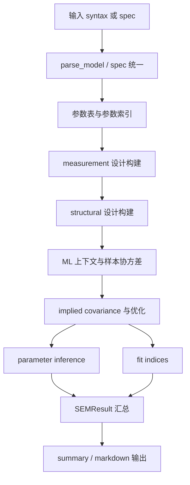
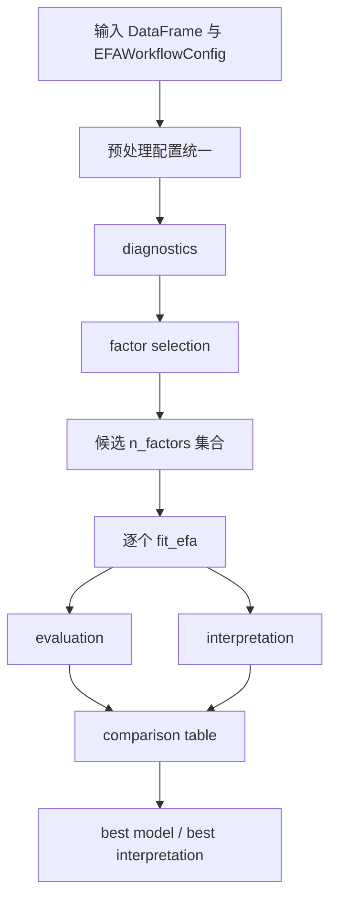
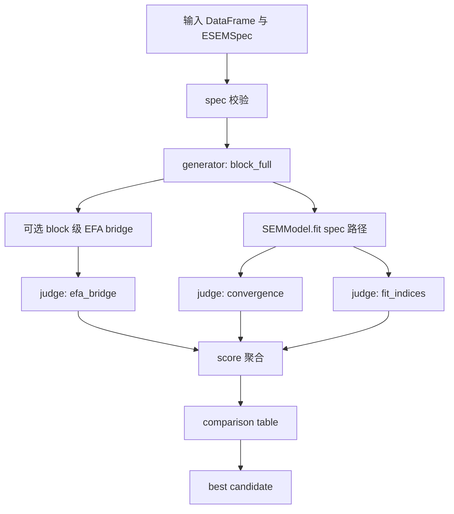

# 当前测试流程总览（SEM / EFA / ESEM，ZH）

当前日期：2026-03-16  
适用分支：`main`

---

## 1. 本文档目的

本文档只做一件事：

1. 把当前仓库里 **SEM / EFA / ESEM 的测试流程** 用步骤图和分层说明整理清楚；
2. 说明这些测试到底在验证什么；
3. 标出它们目前已经覆盖到哪里、还没覆盖到哪里。

这是一份“**当前项目内部流程图文档**”，不是外部软件对照文档。

---

## 2. 总体结论

当前仓库的测试覆盖强度大致如下：

1. **EFA 最成熟**：已经形成 diagnostics -> factor selection -> candidate fitting -> evaluation -> interpretation 的完整工作流测试；
2. **SEM 次之**：已经形成 syntax/spec -> measurement -> structural -> estimation -> inference -> fit indices -> reporting 的原型闭环测试；
3. **ESEM 目前是 MVP**：已能跑通 spec 校验 -> block EFA bridge -> SEM fit -> judge -> selector，但仍只有单一 generator 主线。

换句话说：

- EFA 是“工作流级测试”；
- SEM 是“分层闭环测试”；
- ESEM 是“最小可跑工作流测试”。

---

## 3. 当前 SEM 测试流程

### 3.1 流程图

### 3.2 当前实际测试步骤

#### Step 1：模型输入与解析

主要验证：

1. 语法字符串能否解析为结构化关系；
2. 参数标签、固定值、约束能否正确识别；
3. 非法 token、重复路径、错误约束能否被拒绝。

主要测试文件：

- `tests/test_fit_smoke.py`

#### Step 2：统一到内部 `ModelSpec`

主要验证：

1. `SEMModel("...")` 路径可用；
2. `SEMModel().fit(..., spec=...)` 路径可用；
3. syntax 与 spec 不允许混用；
4. 缺少模型定义会报错。

主要测试文件：

- `tests/test_fit_smoke.py`

#### Step 3：measurement 层构建

主要验证：

1. `Lambda` / `Theta` 形状是否正确；
2. 观测变量、潜变量索引是否稳定；
3. marker 与自由参数位置是否正确；
4. 测量层识别性 warning 是否能出现。

主要测试文件：

- `tests/test_sem_measurement.py`

#### Step 4：structural 层构建

主要验证：

1. `Beta` / `Gamma` / `Psi` 是否正确构建；
2. latent / observed predictor 是否正确映射；
3. 是否能识别循环依赖与异常结构；
4. structural 参数索引是否稳定。

主要测试文件：

- `tests/test_sem_structural.py`

#### Step 5：参数索引统一

主要验证：

1. measurement 与 structural 的参数能否合并到统一向量；
2. `parameter_index -> vector_position` 是否稳定；
3. 重复标签是否共享同一参数位置。

主要测试文件：

- `tests/test_sem_parameter_index.py`
- `tests/test_fit_smoke.py`

#### Step 6：ML 估计

主要验证：

1. 样本协方差是否能构建；
2. implied covariance 是否能生成；
3. 高斯 ML discrepancy 是否可算；
4. 优化器是否能返回参数向量、目标函数、收敛信息。

主要测试文件：

- `tests/test_sem_estimation_ml.py`
- `tests/test_sem_estimation_config.py`

#### Step 7：参数推断

主要验证：

1. 数值 Hessian 是否能转成 `SE / z / p / CI`；
2. Hessian 奇异时是否会退化到 `pseudo_inverse`；
3. 推断状态是否区分 `ok / partial / failed`；
4. 推断失败时是否保留 warning 与失败原因。

主要测试文件：

- `tests/test_sem_inference.py`
- `tests/test_sem_estimation_ml.py`
- `tests/test_fit_smoke.py`

#### Step 8：拟合指标

主要验证：

1. `CFI / TLI / RMSEA / SRMR / AIC / BIC` 是否能计算；
2. 自由度异常时是否正确转为部分不可用；
3. 缺少协方差输入时是否正确标记失败；
4. `fit_status` 和失败原因是否写回结果。

主要测试文件：

- `tests/test_sem_fit_indices.py`
- `tests/test_fit_smoke.py`

#### Step 9：结果展示

主要验证：

1. `summary()` 是否能展示 estimator、free parameters、optimization；
2. 推断摘要是否能展示；
3. fit 摘要是否能展示；
4. Markdown 输出是否与 summary 保持一致。

主要测试文件：

- `tests/test_fit_smoke.py`

#### Step 10：外部 benchmark 基线（首版）

主要验证：

1. 经典公开 benchmark 数据是否已固化到仓库中；
2. provenance / citation 元数据是否完整；
3. `HolzingerSwineford1939` 三因子 CFA 在当前原型实现下是否满足第一批 Level A / Level B 断言；
4. 部分关键负荷与部分拟合指标是否与 `lavaan` 参考值保持宽容差对齐。

当前状态：

1. 已新增 `HolzingerSwineford1939` benchmark 首版自动测试；
2. 已新增 `PoliticalDemocracy` benchmark 首版自动测试；
3. 已新增 boundary warning / failure benchmark 首版自动测试；
4. 当前 benchmark 仍整体处于 prototype-level 基线阶段，但 `HS1939` 与 `PoliticalDemocracy` 已开始进入部分 Level C 参数级数值回归；
5. 其中 `HS1939` 已覆盖 selected loading / observed residual variance / latent variance / latent covariance；
6. `PoliticalDemocracy` 已覆盖 selected loading / structural regression / observed residual variance / selected residual covariance。

补充说明：当前仍未完全达到成熟 SEM 包级别的严格数值等值，主要原因并不在于 SEM 理论公式错误，而在于部分模块仍采用 prototype 级实现：

1. 起点、restart、bounds 与优化稳定化策略仍较朴素；
2. fit indices 的 baseline model / 边界处理 / 数值稳定化细节尚未完全对齐外部参考实现；
3. parameter inference 目前仍主要依赖数值 Hessian，因此 `SE / z / p` 对步长和局部曲率更敏感；
4. 一些 covariance 路径虽已接通，但离“全参数严格数值回归”仍有继续收紧空间。

主要测试文件：

- `tests/test_sem_benchmark_hs1939.py`
- `tests/test_sem_benchmark_political_democracy.py`
- `tests/test_sem_benchmark_boundary_cases.py`

---

## 4. 当前 EFA 测试流程

### 4.1 流程图

### 4.2 当前实际测试步骤

#### Step 1：基础 `fit_efa()` 能力

主要验证：

1. 提取方法是否可运行；
2. 旋转方法是否可运行；
3. 载荷、共同度、独特性、复杂度等输出形状是否正确；
4. `pearson / spearman / polychoric` 路线是否可用；
5. 缺失值策略与 warning 是否生效。

主要测试文件：

- `tests/test_efa.py`

#### Step 2：diagnostics

主要验证：

1. KMO、Bartlett 等前置诊断是否可运行；
2. 输入质量问题是否能通过 warning 暴露。

主要测试文件：

- `tests/test_efa_diagnostics.py`

#### Step 3：因子数建议

主要验证：

1. 并行分析、MAP、Kaiser、scree 等建议是否能运行；
2. 共识规则是否可工作；
3. 候选因子数范围是否合法。

主要测试文件：

- `tests/test_efa_n_factors.py`

#### Step 4：候选模型评价

主要验证：

1. 每个候选模型是否能打分；
2. 比较表是否可生成；
3. 最优候选是否可排序选出。

主要测试文件：

- `tests/test_efa_evaluation.py`
- `tests/test_efa_workflow.py`

#### Step 5：结构解释

主要验证：

1. 主载荷、交叉载荷、共同度、残差解释摘要是否生成；
2. 因子解释表与题项解释表是否生成。

主要测试文件：

- `tests/test_efa_interpretation.py`
- `tests/test_efa_workflow.py`

#### Step 6：完整工作流

主要验证：

1. diagnostics -> selection -> fit -> evaluation -> interpretation 是否能串起来；
2. `candidate_strategy` 是否正确工作；
3. workflow 级 preprocessing 配置是否能统一传播到 diagnostics / selection / fit；
4. comparison table 是否稳定排序。

主要测试文件：

- `tests/test_efa_workflow.py`

---

## 5. 当前 ESEM 测试流程

### 5.1 流程图

### 5.2 当前实际测试步骤

#### Step 1：`spec` 结构与数据兼容性校验

主要验证：

1. block 是否合法；
2. item 是否重复；
3. `variable_types` 是否完整；
4. ordinal 变量是否真的满足 ordinal 条件；
5. structural 引用变量是否在数据中存在。

主要测试文件：

- `tests/test_esem_spec.py`

#### Step 2：workflow 入口

主要验证：

1. `run_esem_workflow(data, spec, config)` 能否跑通；
2. 既支持 mapping spec，也支持 `ESEMSpec`；
3. generator / judge / selector 的配置是否合法。

主要测试文件：

- `tests/test_esem_workflow.py`

#### Step 3：候选生成

当前只测试一个 generator：

1. `block_full`

也就是：

1. 按 block 全展开潜变量；
2. 再把结果统一交给 `SEMModel.fit(...)`。

当前状态：

- **没有多 generator 比较测试**；
- 也还没有 `efa_seeded`、`target_pattern` 的真实测试主线。

主要测试文件：

- `tests/test_esem_workflow.py`

#### Step 4：block EFA bridge

主要验证：

1. 每个 block 能否单独跑 EFA；
2. ordinal block 是否自动切到 `polychoric`；
3. block 级 EFA warning 是否会回流到候选结果。

主要测试文件：

- `tests/test_esem_workflow.py`

#### Step 5：SEM 拟合与 judge

主要验证：

1. `convergence` judge 是否工作；
2. `fit_indices` judge 是否工作；
3. `efa_bridge` judge 是否工作；
4. judge 是否能被聚合成候选总分。

主要测试文件：

- `tests/test_esem_workflow.py`

#### Step 6：候选比较与最佳结果

主要验证：

1. comparison table 能否生成；
2. `best_candidate_id` 是否可选出；
3. 最优候选是否带回 `sem_result` 与 block EFA 结果。

主要测试文件：

- `tests/test_esem_workflow.py`

---

## 6. 三条流程的差异

### 6.1 EFA

当前更像“成熟工作流测试”：

1. 已有多步骤串联；
2. 已有候选比较；
3. 已有解释层；
4. 已有 workflow 级 preprocessing 统一机制。

### 6.2 SEM

当前更像“分层闭环测试”：

1. 更强调内部模块契约；
2. 更强调 measurement / structural / estimation / inference / fit 的衔接；
3. 重点是把原型 SEM 主路径做稳。

### 6.3 ESEM

当前更像“MVP 工作流测试”：

1. 已能跑通一条端到端路径；
2. 但候选生成、judge、selector 还很少；
3. 更接近一个工作流外壳，而不是完整 ESEM 平台。

---

## 7. 当前测试流程已经覆盖到什么程度

### 7.1 已覆盖

1. **SEM**：从输入解析到结果展示的基础闭环；
2. **SEM benchmark（首版）**：`HolzingerSwineford1939`、`PoliticalDemocracy` 与 boundary cases 已有第一批自动化基线测试与 provenance / warning 语义验证；
3. **HS1939 benchmark（增强中）**：已开始使用更贴近 `lavaan` 的 fixed-marker 语法，并扩展到更多 loading / residual variance / latent covariance 的参数级对照；
4. **PoliticalDemocracy benchmark（增强中）**：已开始使用 fixed-marker 语法，并扩展到 selected loading / regression / residual variance 的参数级对照；
5. **PoliticalDemocracy residual covariance（已接入）**：residual covariance 参考值已进入正式自动 benchmark 断言，不再只是 pending / xfail 占位；
6. **EFA**：从 diagnostics 到 best model 的工作流闭环；
7. **ESEM**：从 spec 校验到 best candidate 的 MVP 闭环。

### 7.2 仍未覆盖充分的部分

1. 更完整的真实研究数据回放；
2. 更广泛、更严格的外部软件结果对照（当前 HS1939 与 `PoliticalDemocracy` 都已开始收紧，但更小容差的 covariance / variance / inference 对照仍未完全进入稳定阶段）；
3. 更复杂的 ESEM 候选生成策略；
4. 更完整的稳健估计路径；
5. 更强的数值回归基准。

---

## 8. 一页式总结

如果只看一句话：

1. **EFA**：已经是“工作流级测试”；
2. **SEM**：已经是“分层闭环测试”；
3. **ESEM**：目前还是“最小可跑工作流测试”。

如果只看下一步：

1. SEM 不再以“新增 benchmark 数量”为首要目标，而是优先继续收紧 `HolzingerSwineford1939` 与 `PoliticalDemocracy` 的参数级数值回归；
2. ESEM 继续补多 generator / 多 judge / 多 selector；
3. 整体继续补外部 benchmark 对照测试。

如果只看 SEM 的明确后续动作：

1. 继续补全 benchmark reference.json 的更多参考值与容差说明；
2. 继续收紧 `HS1939` 与 `PoliticalDemocracy` 的 covariance / variance / fit-index 容差；
3. 评估是否把 selected `SE / z / p` 纳入 benchmark；
4. 固定 benchmark 参考值生成流程；
5. 边界 benchmark 继续扩充 warning / failure 语义覆盖，但不把它作为严格数值对齐的主任务。

---

## 9. 外部软件的典型流程：SPSS / AMOS / Mplus

这一节的目的不是评价哪个软件“更好”，而是说明：

1. 外部软件通常怎样完成 EFA / SEM / ESEM；
2. 它们的用户工作流与当前项目的测试工作流有什么差别；
3. 为什么当前项目还需要补 benchmark。

### 9.1 SPSS 的典型 EFA 流程

SPSS 中最常见的是交互式 EFA 流程，大致如下：

1. 导入数据；
2. 在数据视图中手动检查缺失值、极端值、反向题、编码；
3. 打开 `Analyze -> Dimension Reduction -> Factor`；
4. 选择题项；
5. 选择 extraction method；
6. 查看 `KMO` 与 `Bartlett`；
7. 参考 eigenvalue、scree plot、研究经验决定因子数；
8. 选择 rotation；
9. 查看 pattern / structure / communalities / residuals；
10. 手动删题、重复运行，直到结构较稳定；
11. 视需要导出 factor scores。

它的特点是：

1. GUI 驱动；
2. 很依赖研究者逐轮人工判断；
3. 报表成熟；
4. 自动化比较弱。

### 9.2 AMOS 的典型 SEM 流程

AMOS 更接近图形化 SEM/CFA 工作流，常见步骤如下：

1. 在 SPSS 或其他工具中先完成数据清理；
2. 在 AMOS 里画测量模型与结构路径图；
3. 设定 marker、误差项、协方差；
4. 选择估计方法（通常先从 ML 开始）；
5. 运行模型；
6. 查看拟合指标、标准化路径、残差；
7. 查看 modification indices；
8. 根据理论或修模建议调整模型；
9. 重复运行，直到得到可解释结果；
10. 导出表格与图形报告。

它的特点是：

1. 图形建模友好；
2. 非常适合人工修模；
3. 对研究者来说上手直观；
4. 内部数值过程对用户相对黑箱。

### 9.3 Mplus 的典型 SEM / ESEM 流程

Mplus 更接近脚本化建模和研究级估计平台，典型流程如下：

1. 准备数据文件与变量说明；
2. 编写模型语法；
3. 指定 estimator、categorical、missing、grouping 等设置；
4. 运行 CFA / SEM / ESEM 模型；
5. 查看拟合指标、标准化参数、SE、技术输出；
6. 对 ESEM 场景指定 target rotation、block、cross-loading 规则；
7. 查看 modification index、残差与技术诊断；
8. 与替代模型对照；
9. 反复修订模型；
10. 形成研究报告。

它的特点是：

1. 更适合正式研究分析；
2. 对 ESEM、categorical、robust estimator 支持更完整；
3. 可重复性比纯 GUI 更好；
4. 输出体系和方法学细节更成熟。

---

## 10. 当前项目流程与外部软件流程的差距

### 10.1 与 SPSS 相比

当前项目的 **EFA 自动化程度更高**，但 **交互式探索能力更弱**。

优势：

1. 已有 workflow 级流程：diagnostics -> selection -> candidate fitting -> evaluation -> interpretation；
2. 配置和测试更可复现；
3. 更适合批量和自动回归。

差距：

1. 缺少接近 SPSS 报表风格的标准输出；
2. 缺少“逐轮删题/重跑”的交互式支持；
3. 缺少基于真实研究数据的对照回归；
4. 缺少与 SPSS 同一 extraction / rotation 设定下的结果容差验证。

### 10.2 与 AMOS 相比

当前项目的 **内部模块拆分更透明**，但 **研究者操作体验和修模支持更弱**。

优势：

1. measurement / structural / estimation / inference / fit indices 已明确分层；
2. 参数索引和诊断信息更适合后续工程化；
3. 更适合作为可测试、可扩展的代码库。

差距：

1. 没有图形建模流程；
2. 没有 modification indices 主线；
3. 没有成熟的修模反馈循环；
4. 缺少与 AMOS 在 CFA / SEM 基准模型上的拟合与参数对照测试。

### 10.3 与 Mplus 相比

当前项目的 **架构方向已经靠近研究型平台**，但 **方法能力和 benchmark 体系还明显不足**。

优势：

1. 已经具备 syntax/spec -> SEM/ESEM workflow 的基本主线；
2. 已有 ordinal 预处理、polychoric、基础 ML、推断、fit indices；
3. ESEM 已有 generator/judge/selector 的架构方向。

差距：

1. ESEM 还只是 MVP，当前只有 `block_full`；
2. `WLSMV`、更稳健估计、categorical SEM 闭环还不完整；
3. 缺少 target rotation / seeded ESEM 的真实对照；
4. 缺少与 Mplus 或 lavaan 风格输出的基准比对测试。

---

## 11. 为什么当前必须补 benchmark

当前测试体系已经能说明：

1. 各模块能接起来；
2. 多数边界场景不会直接崩；
3. 结果对象、warning、摘要输出正在变得更稳定。

但它还不能充分说明：

1. 当前结果与外部成熟软件是否足够一致；
2. 某个数值改动是否改变了统计含义；
3. 当前 ESEM/SEM 输出是否达到研究可比水平。

因此，下一步不能只补更多单元测试，还要补 **跨实现 benchmark 测试**。

---

## 12. 如果要对照 SPSS / AMOS / Mplus，当前还缺哪些具体 benchmark 用例

下面按模块列出“最值得优先补”的 benchmark。

### 12.1 EFA 对照 SPSS 的 benchmark 用例

#### Benchmark EFA-1：连续变量两因子基准数据

目标：

1. 用固定连续数据；
2. 在 `principal axis factoring + varimax` 条件下；
3. 对照 SPSS 输出的载荷、共同度、解释方差、残差指标。

当前缺口：

1. 现在只有内部合成数据 smoke；
2. 没有外部软件导出的目标结果表。

建议断言：

1. 载荷绝对值容差；
2. communalities 容差；
3. explained variance 容差；
4. 因子顺序允许重排，但结构应一致。

#### Benchmark EFA-2：oblique rotation 基准

目标：

1. 对照 SPSS 的 `promax` 或 `oblimin` 输出；
2. 检查 pattern matrix、factor correlation matrix。

当前缺口：

1. 当前虽然测试了 oblique 路径能运行；
2. 但没有与外部结果进行矩阵级比较。

#### Benchmark EFA-3：ordinal 题项相关矩阵对照

目标：

1. 用 ordinal 数据；
2. 对照 polychoric 或 rank-based 相关矩阵；
3. 验证相关矩阵、特征值、因子数建议是否稳定。

当前缺口：

1. 现在只验证 polychoric 路线可跑；
2. 没有和外部软件或已知参考实现对照。

---

### 12.2 SEM 对照 AMOS / Mplus 的 benchmark 用例

#### Benchmark SEM-1：单因子 CFA 基准模型

目标：

1. 用简单单因子测量模型；
2. 对照 AMOS / Mplus / lavaan 的参数估计、SE、CFI/TLI/RMSEA/SRMR。

建议模型：

1. `eta =~ x1 + x2 + x3 + x4`

建议断言：

1. 载荷估计值容差；
2. 残差方差容差；
3. 拟合指标容差；
4. SE 与 CI 的方向与数量级合理。

当前缺口：

1. 现在主要验证“能跑”和“结果字段存在”；
2. 没有对照外部成熟实现的固定数值基准。

#### Benchmark SEM-2：两因子 CFA + 潜变量相关

目标：

1. 对照两个潜变量、各自多个题项的标准 CFA；
2. 检查 latent covariance / correlation。

建议模型：

1. `eta1 =~ x1 + x2 + x3`
2. `eta2 =~ y1 + y2 + y3`
3. `eta1 ~~ eta2`

当前缺口：

1. 目前 structural 与 measurement 测试是模块级的；
2. 缺少标准 CFA benchmark 对照。

#### Benchmark SEM-3：测量 + 结构回归模型

目标：

1. 对照完整 SEM：测量层 + latent regression；
2. 检查路径系数、扰动方差、拟合指标。

建议模型：

1. `eta1 =~ x1 + x2 + x3`
2. `eta2 =~ y1 + y2 + y3`
3. `eta2 ~ eta1 + z1`

当前缺口：

1. 现在 structural 路径测试更多是索引和构建正确；
2. 缺少对照外部软件的完整 SEM 数值回归。

#### Benchmark SEM-4：边界模型 benchmark

目标：

1. 设计一个 AMOS / Mplus 中也会出现 warning 的模型；
2. 对照看当前项目是否给出相似级别的诊断。

建议场景：

1. 近奇异协方差；
2. df = 0 或接近 0；
3. 非正定 Hessian；
4. 参数打到边界。

当前缺口：

1. 现在有内部状态化 warning；
2. 但还没有“与外部软件 warning 语义近似一致”的基准测试。

---

### 12.3 ESEM 对照 Mplus 的 benchmark 用例

#### Benchmark ESEM-1：单 block 两因子 baseline ESEM

目标：

1. 用单 block、两因子、允许交叉载荷的数据；
2. 对照 Mplus ESEM baseline 输出；
3. 检查 block_full 路线是否能得到接近结构。

当前缺口：

1. 现在只有 `block_full` 的 smoke；
2. 没有外部 ESEM 软件结果对照。

#### Benchmark ESEM-2：EFA-seeded 候选生成 benchmark

目标：

1. 先由 EFA 产生主载荷模式；
2. 再生成 seeded 候选；
3. 与 Mplus 或研究论文给出的目标结构比较。

当前缺口：

1. 当前代码还没有真正落地 `efa_seeded` 主线；
2. 因而也无法建立对应 benchmark。

#### Benchmark ESEM-3：target-pattern benchmark

目标：

1. 对照 target rotation 或近似目标结构；
2. 检查 cross-loading 的约束/近似约束行为。

当前缺口：

1. 当前项目中该路线尚未真正落地；
2. 因而没有任何相关 benchmark。

---

## 13. 建议的 benchmark 优先级

如果只能先补最小一批，建议按下面顺序：

### P0：先补

1. **EFA-SPSS 连续变量两因子 benchmark**
2. **SEM-CFA 单因子 benchmark**
3. **SEM-测量+结构路径 benchmark**

原因：

1. 最容易获得外部参考输出；
2. 最能帮助判断当前数值链是否已经可靠；
3. 对后续推断、fit indices、优化鲁棒性最有价值。

### P1：再补

1. **EFA-oblique benchmark**
2. **SEM-边界 warning benchmark**
3. **ordinal/polychoric benchmark**

### P2：最后补

1. **ESEM baseline benchmark**
2. **ESEM seeded benchmark**
3. **ESEM target-pattern benchmark**

原因：

1. 当前 ESEM 主线还在 MVP；
2. 过早做复杂 ESEM benchmark，会被中间架构变化反复打断。

---

## 14. 当前项目最核心的问题（结合外部流程对照）

结合 SPSS / AMOS / Mplus 的典型流程，可以把当前项目问题概括为四类：

### 14.1 外部对照不足

当前最重要的问题不是“没有测试”，而是：

1. 有很多内部测试；
2. 但缺少外部软件级 benchmark。

这意味着当前测试更能证明“代码一致性”，还不够证明“统计结果外部可比性”。

### 14.2 研究者工作流支持不足

与 SPSS / AMOS 相比，当前项目缺少：

1. 交互式删题/修模流程；
2. 图形化建模；
3. modification index 主线；
4. 更接近研究报告习惯的表格导出。

### 14.3 ESEM 方法能力尚未展开

与 Mplus 风格 ESEM 相比，当前项目最大差距在于：

1. generator 太少；
2. selector 太弱；
3. target / seeded 路线未形成；
4. benchmark 也因此还无从建立。

### 14.4 数值回归还需要进一步工程化

虽然当前已经有大量测试，但还需要：

1. 固定基准数据；
2. 固定外部参考输出；
3. 固定容差范围；
4. 建立真正跨版本稳定的 benchmark 测试。

---

## 15. 关联文件

### 代码入口

1. `src/psysem/efa/workflow.py`
2. `src/psysem/esem/workflow.py`
3. `src/psysem/sem/core.py`

### 代表性测试

1. `tests/test_efa_workflow.py`
2. `tests/test_efa.py`
3. `tests/test_fit_smoke.py`
4. `tests/test_sem_estimation_ml.py`
5. `tests/test_sem_inference.py`
6. `tests/test_sem_fit_indices.py`
7. `tests/test_esem_workflow.py`
8. `tests/test_esem_spec.py`

### 相关文档

1. [SEM Phase 实施文档（ZH）](sem-phase-implementation.zh-CN.md)
2. [ESEM 模块化判断工作流实施文档（ZH）](esem-modular-workflow.zh-CN.md)
3. [ESEM 最小可跑路径（MVP，ZH）](esem-mvp-run.zh-CN.md)
4. [EFA Phase 1 实施文档（ZH）](efa-phase1-implementation.zh-CN.md)
5. [EFA Method Expansion Roadmap（ZH）](efa-method-expansion-roadmap.zh-CN.md)
