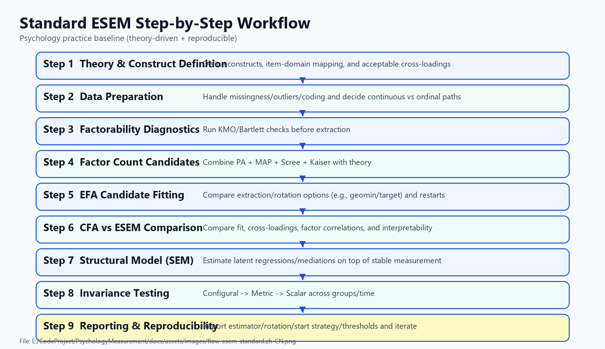
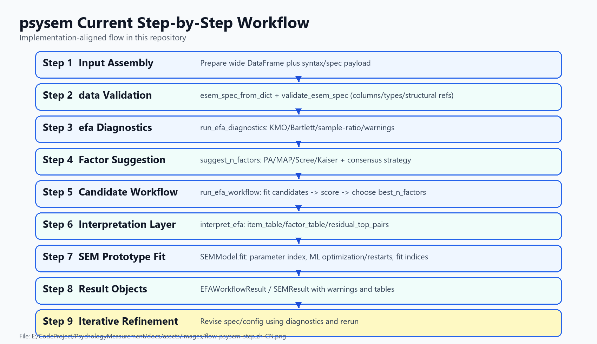

# psysem Docs

本页是当前 `psysem` 文档入口，按 **EFA / SEM / ESEM** 三条主线整理。

## Current Flow Diagrams

### Standard ESEM step workflow

### `psysem` step workflow

### Overall module flow

### `data` module flow

### `efa` module flow

## 核心文档

### Shared

- [Shared Preprocessing Module Extraction (ZH)](preprocessing-module-extraction.zh-CN.md)

### EFA

- [EFA Phase 1 Implementation (ZH)](efa-phase1-implementation.zh-CN.md)
- [EFA Method Expansion Roadmap (ZH)](efa-method-expansion-roadmap.zh-CN.md)

### SEM

- [SEM Phase Implementation (ZH)](sem-phase-implementation.zh-CN.md)

### ESEM

- [ESEM Modular Workflow Plan (ZH)](esem-modular-workflow.zh-CN.md)
- [ESEM MVP Runnable Path (ZH)](esem-mvp-run.zh-CN.md)

### Research

- [ESEM Ecosystem and Practice Baseline (ZH)](esem-baseline-landscape.zh-CN.md)

## 当前范围

- 共享 `preprocessing` 模块已经独立出来，可供 EFA / ESEM / 未来 network 共用
- `psysem.data` 已覆盖 ESEM `spec` / 数据输入校验
- `psysem.efa` 已具备诊断、因子数建议、候选评分与解释层基础能力
- EFA 提取/旋转已扩展到 `minres`、`promax`、`oblimin`、`geomin`、`target`
- `psysem` SEM 已具备 measurement/structural 参数映射、ML 原型优化、基础推断与基础拟合指标
- ESEM 已具备最小可跑 workflow，可输出候选比较结果与最佳候选

## 当前最建议的下一步

1. 基于共享 preprocessing 起 `network` MVP
2. 继续推进 ESEM 模块化：`efa_seeded`、generator/judge/selector
3. 继续补 ordinal / robust 路线：`polychoric` 稳健性、mixed-type、`MLR/WLSMV`

## 建议阅读顺序

1. 如果要看“当前怎么用”，先读 [docs/parameters.zh-CN.md](parameters.zh-CN.md) 与 [docs/esem-mvp-run.zh-CN.md](esem-mvp-run.zh-CN.md)。
2. 如果要看“共享预处理层已经做到哪里、为什么它是下一步 network 的基础”，先读 [docs/preprocessing-module-extraction.zh-CN.md](preprocessing-module-extraction.zh-CN.md)。
3. 如果要看“EFA 现在到哪一步、后面还缺什么”，读 [docs/efa-phase1-implementation.zh-CN.md](efa-phase1-implementation.zh-CN.md) 与 [docs/efa-method-expansion-roadmap.zh-CN.md](efa-method-expansion-roadmap.zh-CN.md)。
4. 如果要看“ESEM / SEM 后续怎么推进”，读 [docs/esem-modular-workflow.zh-CN.md](esem-modular-workflow.zh-CN.md)、[docs/esem-mvp-run.zh-CN.md](esem-mvp-run.zh-CN.md) 与 [docs/sem-phase-implementation.zh-CN.md](sem-phase-implementation.zh-CN.md)。
